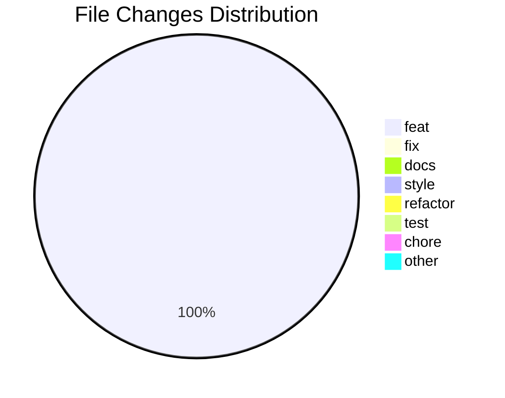

## 📝 

### Commits

- [feat(navbar): add navigation menu and improve styling](https://github.com/camyacodes/code-journey-tracker/blob/main/LearningBehindTheScreens/4/24/2025/23%3A04%3A49-30.md)

### 📈 Productivity Metrics
- Total Commits: 1
- Lines Per Hour: 204
- Most Frequent Frequency: 30.0

## 📈 Visual Representation

